# Vantage: Product Information & Technical Specification

> **Autonomous AI Multi-Agent Hackathon Strategist & Enterprise Architecture OS**  
> *Transforming raw challenge statements into winning architectures, technical feasibility audits, and jury-ready pitch decks.*

---

## 1. Executive Summary & Product Identity

### 1.1 What is Vantage?
**Vantage** is an autonomous, multi-agent strategic intelligence platform built specifically for competitive engineers, founders, and hackathon teams. Rather than acting as a simple generic code-completion assistant or conversational chatbot, Vantage functions as an **elite virtual council of senior engineering and product executives**.

In time-constrained, high-stakes development sprints (such as 24-to-48-hour hackathons, venture pitch competitions, and startup MVP builds), teams face an existential problem: **the build-trap failure cycle**. Builders frequently choose overly ambiguous ideas, over-scope their features, construct fragile architectures without clear trade-offs, and deliver unconvincing demos to judging panels.

Vantage orchestrates a council of specialized AI agents powered by **Google Gemini** and **LangGraph** to autonomously research the problem space, benchmark open-source GitHub solutions, design production-grade microservice architectures with interactive Mermaid diagrams, stress-test technical feasibility, and formulate investor-grade pitch narratives.

---

## 2. Core Capabilities & What Vantage Can Do

### 2.1 The Council of Specialized Agents
Vantage divides strategic intelligence across discrete, domain-expert agents:

| Agent | Codename | Strategic Role & Deliverables |
| :--- | :--- | :--- |
| **Principal Architect** | `principal_architect` | Generates enterprise-grade system blueprints, defining service boundaries, API protocols, caching layers (Redis), event streaming (Kafka), persistence topologies (PostgreSQL/Timescale), and syntax-checked C4 Mermaid architecture diagrams. |
| **Feasibility & Trade-offs** | `feasibility` | Computes a quantitative **Feasibility Score (0–100)**, delineates MVP vs. Post-Hackathon scope, audits technical debt risks, and identifies 24-hour delivery bottlenecks. |
| **Pitch Strategist** | `pitch` | Crafts a high-impact narrative: 30-second elevator hook, problem-solution fit, jury rubric alignment, market sizing (TAM/SAM/SOM), and unfair competitive moats. |
| **Live Web & GitHub Scraper** | `scraper` / `github_scraper` | Queries DuckDuckGo and GitHub in real time to uncover competing tools, precedent hackathon winners, and existing open-source libraries to prevent reinventing the wheel. |
| **Jury Profiler** | `profiler` | Analyzes organizer guidelines and judging rubrics to align the technical proposal directly with how judges grade (Innovation, Impact, Feasibility). |
| **Devil's Advocate** | `devils_advocate` | Pokes holes into architectural assumptions, flags single points of failure, and generates the 5 hardest questions judges will ask during the demo. |
| **Scrum Master** | `scrum_master` | Formulates an hour-by-hour sprint schedule, separates frontend/backend tasks for zero-blocking parallelization, and plans delivery checkpoints. |
| **UX Visionary** | `ux_visionary` | Maps user journeys, wireframe layouts, visual hierarchy tokens, and high-impact UI elements to maximize demo presentation appeal. |
| **Business Strategist** | `business` | Formulates monetization mechanics, unit economics, go-to-market strategies, and post-hackathon sustainability roadmaps. |

---

### 2.2 Interactive Architecture Studio
- **Dynamic Mermaid C4 Diagrams**: Automatically rendered high-resolution flowcharts and component diagrams.
- **Natural Language Diagram Editing**: Users can modify architectures with plain-English instructions (e.g., *"Add a Redis cache layer"*, *"Integrate Kafka event bus"*, *"Use OAuth2 with Keycloak"*). The engine surgically rewires graph nodes and edges.
- **Studio Tooling**: Full zoom controls, pan navigation, SVG export, and live syntax error recovery.

### 2.3 Instant Code & API Generation
- **Polyglot Client Generation**: Provides ready-to-run copyable integration code in **cURL**, **Python (httpx)**, and **TypeScript (fetch)** for direct headless invocation.

### 2.4 User Accounts & Persistent Workspace
- **Complete Authentication**: JWT token authentication, bcrypt password hashing, and token-verified password resets.
- **Historical Runs & Saved Blueprints**: Every strategic execution is persisted with its complete agent state, allowing teams to review, resume, and fork past runs.

---

## 3. Technology Stack & System Topology

```
┌────────────────────────────────────────────────────────────────────────┐
│                        VANTAGE TECHNOLOGY STACK                        │
└────────────────────────────────────────────────────────────────────────┘

 [FRONTEND APPLICATION LAYER]
   • Framework: Next.js 16.3.8 (App Router & React 19)
   • Bundler: Turbopack
   • Language: TypeScript 5
   • Styling: Tailwind CSS v4, Custom CSS Glassmorphism
   • Motion & FX: GSAP 3.15, Lenis Smooth Scroll, Framer Motion
   • Diagrams: Mermaid.js 12.1 + Custom SVG Pan/Zoom/Export Engine
   • Icons & Markdown: Lucide React, React-Markdown, Remark-GFM

 [BACKEND API & ORCHESTRATION LAYER]
   • Framework: FastAPI 0.142.2 (Python 3.11+)
   • Server Engine: Uvicorn ASGI Server with StatReload
   • Data Validation: Pydantic v2.13 & Pydantic Settings
   • Agent Orchestration: LangGraph 1.2.12 (StateGraph DAG)
   • LLM Toolchain: LangChain Google GenAI, google-genai SDK
   • Web Reconnaissance: HTTPX (Async HTTP), BeautifulSoup4 (HTML Parsing)
   • Security & Auth: PyJWT, Bcrypt, Email-Validator

 [PERSISTENCE & STORAGE LAYER]
   • Database: PostgreSQL 16
   • Vector Engine: pgvector (Embeddings & Semantic Search)
   • Containerization: Docker & Docker Compose
```

---

## 4. End-to-End Operational Flow & Execution Lifecycle

The operational flow follows a structured, multi-stage state transition pipeline:

```mermaid
sequenceDiagram
    autonumber
    actor User as Builder / Team
    participant FE as Next.js Frontend
    participant API as FastAPI Gateway
    participant PM as Persistence Middleware
    participant LG as LangGraph Orchestrator
    participant Ext as Web & GitHub Recon
    participant Gemini as Google Gemini LLM
    participant DB as PostgreSQL (pgvector)

    User->>FE: Inputs Organizer Name & Problem Statement
    User->>FE: Selects Model & Enables Specific Agents
    FE->>API: POST /api/playground/generate (PlaygroundRequest)
    API->>PM: Verify JWT Auth & Inject Run Context
    
    rect rgb(25, 30, 45)
        Note over API,LG: Agent Execution Pipeline
        API->>LG: Initialize HackathonState
        
        alt Reconnaissance Enabled
            LG->>Ext: Search DuckDuckGo & GitHub Repositories
            Ext-->>LG: Competitor Links, Precedents, Open Source Libs
        end

        LG->>Gemini: Invoke Jury Profiler (Rubric & Scoring Matrix)
        Gemini-->>LG: Evaluation Strategy Formulated

        par Architectural Synthesis & Feasibility
            LG->>Gemini: Principal Architect (Generates C4 & Services)
            LG->>Gemini: Feasibility Engine (MVP Milestones & Risk Score)
        and Presentation Strategy
            LG->>Gemini: Pitch Deck Strategist (Hook, TAM, Storyline)
            LG->>Gemini: Devil's Advocate (Edge Cases & Counter-arguments)
        end
    end

    LG-->>API: Synthesized HackathonState Output
    API->>PM: Intercept Response & Extract Execution Metadata
    PM->>DB: Persist Run Record & Generated Blueprint to Database
    API-->>FE: Stream Complete JSON Response with X-Run-Id
    FE->>User: Render Interactive Architecture, Feasibility & Pitch Deck
```



---

## 5. Architectural Pipeline Deep Dive

### 5.1 Stage 1: Ingestion & State Initialization
The client submits a `PlaygroundRequest`:
```json
{
  "organizer_name": "Smart India Hackathon (SIH)",
  "problem_statement": "Real-time AI mine subsidence monitoring and early warning system.",
  "model": "gemini-3.5-flash-lite",
  "temperature": 0.7,
  "enabled_agents": ["scraper", "profiler", "feasibility", "blueprint", "pitch"]
}
```
The FastAPI router normalizes constraints and initializes the typed `HackathonState`.

### 5.2 Stage 2: Autonomous Intelligence Reconnaissance
If web/scraping agents are toggled:
- The **Scraper Agent** extracts high-intent problem keywords and queries DuckDuckGo for existing governmental initiatives, research papers, and commercial competitors.
- The **GitHub Scraper Agent** inspects open-source repositories to discover existing models, sensor integration SDKs, and starter templates.

### 5.3 Stage 3: Senior Architectural Design & Diagram Validation
- The **Principal Architect Agent** drafts the solution topology into distinct functional layers:
  1. *Client & Edge Layer* (Sensors, IoT nodes, Mobile apps)
  2. *Ingress & Gateway Layer* (Kong, API Gateway, EMQX Broker)
  3. *Event Streaming & Message Bus* (Apache Kafka, RabbitMQ)
  4. *Microservices Layer* (FastAPI, Go, Inference engines)
  5. *Persistence & Cache Layer* (PostgreSQL, TimescaleDB, Redis, S3)
- **Mermaid Syntax Sanitizer**: The generated diagram code is passed through a deterministic sanitizer (`utils.py`) that auto-fixes common LLM diagram generation errors (e.g. unquoted parentheses inside node labels, improper directional tags) to ensure zero render failures on the frontend.

### 5.4 Stage 4: Risk Audit & Feasibility Scoring
- Evaluates the proposed technical stack against hackathon constraints:
  - Technical Complexity Score (0–100)
  - Time-to-MVP Feasibility Score (0–100)
  - Critical Bottlenecks & Recommended Scope Cuts
  - Production Scaling & Security Limits

### 5.5 Stage 5: Pitch Formulation & Storytelling
- Translates deep technical engineering into a persuasive presentation:
  - **Hook**: A problem-statement opening question.
  - **The Solution**: Contrast between existing methods and the Vantage blueprint.
  - **Demo Script**: Step-by-step 3-minute hackathon demo walkthrough.
  - **Commercial Viability**: Market size and unit economics.

### 5.6 Stage 6: Persistence & Delivery
- **Persistence Middleware** intercepts outgoing responses, logs the execution duration, associates the run with the authenticated user ID, and records the item in PostgreSQL.
- The frontend renders the unified output across 5 specialized tabs:
  1. **Architecture Studio**: Diagram viewing, zoom/pan, export, and live prompt-based editing.
  2. **Feasibility & Trade-offs**: Numerical score gauges, risk analysis, and MVP roadmap.
  3. **Pitch Deck**: Presentation narrative, demo script, and market moat.
  4. **Web Intel**: Live competitor benchmark links and GitHub references.
  5. **Diagnostics & Raw JSON**: Token usage, latency diagnostics, and exportable JSON.

---

## 6. Safety, Fallbacks & Error Resilience

Vantage incorporates defensive engineering to guarantee uptime under API rate limits or LLM hallucinations:
1. **Multi-Model Fallbacks**: Seamless failover across Gemini models (`gemini-3.5-flash-lite`, `gemini-2.5-flash`, `gemini-3.0-pro`).
2. **Deterministic Fallback Generators**: If a generative model call encounters an API quota limit, the backend invokes domain-specific fallback generators (`generate_fallback_blueprint`, `generate_dynamic_feasibility_fallback`, `generate_dynamic_pitch_fallback`) to deliver a fully structured architecture based on problem keywords without throwing 500 errors.
3. **Mermaid Auto-Recovery**: If a diagram has syntax defects, the frontend parser attempts multi-stage regex repairs before falling back to a structured topological text view.

---

## 7. Product Summary Matrix

| Metric / Dimension | Specification |
| :--- | :--- |
| **Primary Target Users** | Hackathon Competitors, Engineering Leads, Early-Stage Founders, Innovation Labs |
| **Average End-to-End Latency** | 3.5s – 7.2s (Full Council Pipeline) |
| **Supported LLM Runtimes** | Google Gemini (via `langchain-google-genai` and `google-genai`) |
| **Supported Database** | PostgreSQL 16 with `pgvector` |
| **Deployment Form Factor** | Dockerized Microservices (FastAPI ASGI + Next.js App Router) |
| **License** | MIT License |
